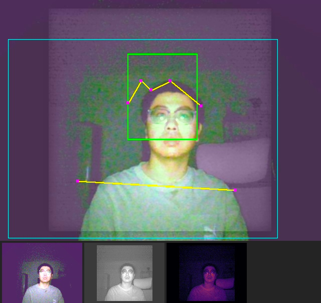
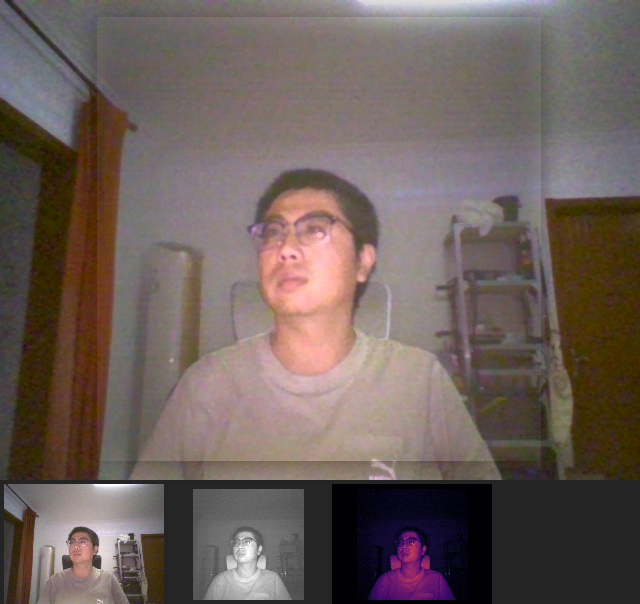

# Camera Use — Windows 双摄（RGB + 红外）原生工具集

用一台普通的 **Windows Hello 笔记本摄像头**，做出一套「可见光 + 红外」的实时成像与感知系统：
**RGB + IR 实时融合**（暗光下看清人）、**原生曝光/白平衡直控**、**暗场校准**、
**人物 / 人脸 / 骨架 / 手势检测**，以及给 AI agent 用的 **MCP 服务器**（让 agent 能"看见"物理世界）。

后端是**纯 Go 标准库 + Windows syscall**：直接调 Media Foundation 采集、SetupAPI 找设备，
**零第三方依赖、离线可构建**（`GOPROXY=off` 能编过）。

> **缘起**：用 OpenCV 打开这个摄像头画面**永远是暗的** —— 根因是它只会用 `IAMCameraControl` 的
> Manual 标志，而正确做法是把曝光切到 **Auto**。为此把整条链路（设备发现 → 采集 → 处理 → 呈现）
> 重写成了原生实现，顺带把被 Windows Hello 藏起来的**红外相机**也用上了。

## 效果

| 控制台（三栏 + 底部实时事件/趋势） | RGB + IR 融合 + 四路缩略图 |
|---|---|
|  |  |

| 可见光原图（HP FHD 相机） | 红外黑白（Windows Hello 相机） |
|---|---|
|  |  |

> 截图来自开发者的实际房间，仅作效果演示；如涉及隐私请自行替换。

## 能做什么

**采集与设备**
- Media Foundation 直采，原生枚举设备；**发现被隐藏的 IR 相机**（它不在 DirectShow/MF 枚举里，得用 SetupAPI 按设备接口类别找）
- 码流可选 **MJPG / NV12 / YUY2**，分辨率到 1080p；**带宽规则**自动判断能不能和 IR 同开
- **原生曝光控制**（`IAMCameraControl`）：Auto / Manual + 范围读取 —— 根治"画面过暗"
- **原生白平衡/画质直控**（`IAMVideoProcAmp`）：色温 2800~6500K，含**自动校准**（扫两轮取最中性档）

**成像**
- **RGB + IR 实时融合**：IR 出亮度、RGB 出色度，暗光下比单用可见光清楚得多
- **暗场校准**：遮住镜头采 30 帧，扣掉固定图案噪声/读出偏置/热噪点
- **色彩处理**：自实现 LAB（对齐 OpenCV）、白平衡（截尾均值）、**暗部去彩**（治"暗处发紫"）、Gamma
- 多视图：融合 / 可见光 / 红外 / **边缘图（IR 增强）** / **补光差分** / 红外伪彩 / **暗场热点图** / **配准误差图**
- 自动配准 RGB 与 IR（梯度图 + 粗搜 + 细搜，约 100ms）

**感知**
- **人物存在与位置**：IR 差分 + 运动检测，**无模型**（静止的人也能测到）
- **人脸检测**：原生 Viola-Jones（cascade XML 当数据文件用，零依赖）**+ 旁路 YOLO 人脸**
- **姿态骨架**（YOLOv8n-pose 17 点）与**手部 21 点 + 五指手势**
- 旁路推理走 **DirectML(GPU)**，实测比 CPU 快约 20 倍（且比 CUDA 还快 3.7 倍）

**呈现与控制**
- 单条 **MJPEG 拼图流**（主视图 + 4 缩略图拼一张，浏览器每帧只解一张 JPEG）
- Web 控制台：三栏布局 + **底部实时状态条 / 事件时间线 / 趋势图**
- 事件流：谁进来了/谁走了、手势变化、人脸增减、采集切换、暗场校准（带时间戳）
- **相机按需打开、空闲自动释放**（不长期占用摄像头）

**给 Agent**
- **MCP 服务器**（stdio，纯标准库）：`camera_look` / `camera_observe` / `camera_control` 三个参数化工具
- 配套 **`SKILL.md`**：工作流、五个必踩的坑、数字怎么读

## 快速开始

需要 **Windows 10/11 + Go 1.21+**（无需 OpenCV / Python / 网络）。

```powershell
git clone https://github.com/alwaysmy/camera-use.git
cd camera-use/backend

.\build.ps1            # 离线构建（GOPROXY=off，证明零依赖）
.\start.ps1            # 一键启动：检查依赖 → 停旧实例 → 起后端 → 开浏览器
```

控制台在 **http://127.0.0.1:8770/**。

**首次使用建议三步**
1. **暗场校准** —— 用不透光物**完全盖住镜头**（RGB 和 IR 两个窗口都要遮），点「暗场校准」
2. **相机白平衡** —— 点「自动校准」扫两轮取最中性档（**灯光变了要重跑**，或直接用自动档）
3. **想要 GPU 推理** —— `pip install onnxruntime-directml mediapipe`（可选，装了旁路才快）

**不用脚本也行**
```powershell
.\camera_backend.exe -help                      # 看全部参数（注意 -h 是"高度"不是 help）
.\camera_backend.exe -open                      # 最简：MJPG + IR
.\camera_backend.exe -codec nv12 -vision -open  # 推荐：未压缩 + YOLO 旁路
.\camera_backend.exe -probe                     # 采集链路自检（不需要打开控制台）
```

## 给 Agent 用（MCP）

```json
{
  "mcpServers": {
    "camera": {
      "command": "D:\\path\\to\\camera-use\\backend\\camera_backend.exe",
      "args": ["-mcp"]
    }
  }
}
```

| 工具 | 参数 | 作用 |
|---|---|---|
| `camera_look` | `view`(8 种) / `quality` / `max_width` / **`detect`** | 看画面，返回 JPEG。`detect:true` 才拉起 YOLO 叠加 |
| `camera_observe` | `what` = summary/person/face/pose/hand/state/events | 观察：一句话概述 / 结构化检测 / 事件流 |
| `camera_control` | `config` / `exposure` / `camera_wb` / `params` | 反控相机与处理参数 |

**即用即开**：MCP 进程毫秒级起来（不碰相机）；首次需要画面才开相机（1~2s）；
`camera_look` 不带 `detect` **不会启动 YOLO**；空闲 60s 释放相机、120s 关闭旁路。

> **先读 [`SKILL.md`](SKILL.md)** —— 五个坑（未压缩+IR 会掉到 0fps、IR 相机独占、
> 暗场必须先遮镜头、白平衡跟灯光绑定、LED 差 <12 时 IR 差分不可靠）不预先知道一定会踩。

## 项目结构

```
backend/
├── camera_backend.exe    产物（build.ps1 生成）
├── build.ps1 / start.ps1  离线构建 / 一键启动
├── src/                  18 个 .go —— 全部实现
│   ├── mf.go devices.go camera.go    Media Foundation / SetupAPI / 相机会话
│   ├── yuv.go lab.go image.go align.go  像素管线（YCbCr → LAB 融合 → 编码）
│   ├── face.go person.go vision.go  检测（Viola-Jones / IR差分+运动 / 旁路结果绘制）
│   ├── engine.go web.go probe.go   引擎 / HTTP+前端 / 自检
│   ├── mcp.go lifecycle.go paths.go MCP 服务器 / 按需启停 / 路径锚定
│   └── events.go lut.go             事件流 / INFERNO 色表
├── tools/                Python：模型导出 / 旁路推理 / 后端基准
├── models/               ONNX + MediaPipe（运行时零联网）
└── captures/ calib/      运行期产物（.gitignore）
```

## 实测数据（本机：Ryzen 9 7945HX + RTX 5070 Ti）

| 项 | 数值 |
|---|---|
| 算子（640×480 融合：warp + fuse + 编码） | **7.8 ms/帧** → 单核 128 fps |
| 拼图 MJPEG 流 | **30 fps**（客户端实测 29.6），单帧 12 ms |
| RGB + IR 并发 | 14.9 fps(NV12) + 29.8 fps(YUY2) |
| 旁路推理（人脸+骨架+手部，DirectML） | **face 1.4ms + pose 2.4ms**（CPU 是 20 倍慢） |
| 推理后端对比 | DirectML **比 CUDA 快 3.7×**、比 CPU 快 20×（小模型上 CUDA 的启动开销占主导） |
| 空闲 CPU | **0%**（没人看流就不渲染） |

## 已知限制

- **只在 Windows 上跑**（Media Foundation / SetupAPI / IAMVideoProcAmp 都是 Windows 专有）
- 未压缩码流（YUY2/NV12）与 IR **不能同时开**：实测 YUY2+IR 会把 RGB 挤到 **0 fps**（USB 带宽，非故障）
- **IR 相机独占**：Windows Hello 开着时别的程序用不了；同机同一时刻只能一个进程用
- 相机白平衡**跟灯光绑定**：手动档在校准后换灯会偏色，需要重跑自动校准
- 旁路（YOLO/MediaPipe）需要 Python + onnxruntime + mediapipe，是**可选组件**；不装则人脸退回原生 Viola-Jones

## 许可证

**AGPL-3.0** —— 因为仓库内捆绑了 Ultralytics YOLOv8 权重（其许可证为 AGPL-3.0）。
第三方组件与许可证清单见 [`NOTICE.md`](NOTICE.md)。

> **想改成 MIT**：删掉 `backend/models/yolov8n-*.onnx` 两个文件，把 LICENSE/NOTICE 换成 MIT 即可 ——
> 旁路会提示缺模型，`python tools/export_models.py` 可一键重新生成。

---

# 附录：早期 Python 实现（历史存档）

下面是最初用 Python + OpenCV + duvc-ctl 写的版本。**功能已被上面的原生 Go 实现覆盖**，
保留它是为了记录排查过程（怎么把 IR 相机挖出来、怎么定位"OpenCV 只用 Manual 标志"这个根因）。
## 一、根本原因

OpenCV 的 DirectShow 后端调用 `IAMCameraControl::Set()` 时把 Flags 硬编码成
`CameraControl_Flags_Manual`，**没有** `Auto`。Windows 相机应用走的是
`CameraControl_Flags_Auto`，所以同一个摄像头在 Windows 相机里正常、在 OpenCV 里发暗。

解法是绕过 OpenCV，用 `duvc-ctl`（DirectShow COM）把曝光标志设成 Auto：

```python
from camera_core import CameraController

with CameraController("rgb") as cam:
    cam.set_exposure(auto=True)         # 根治：亮度 20 → 110
    cam.snapshot("photo.jpg")
```

## 二、这台机器上的设备真相（实测）

**索引是反的 —— 这是本项目最容易踩的坑，旧文档当年写错了。**

| 索引 | 设备 | 类型 | 实测分辨率 | 实测亮度 | 备注 |
|---|---|---|---|---|---|
| 0 | HP Wide Vision FHD Camera | **rgb** | 640×480 | **110+** | 真正能用的主相机（MI_00）|
| 1 | Nikon Webcam Utility | **virtual** | 1024×768 | **8.6 恒定** | 尼康虚拟相机；宿主没推流时是一张静态占位图 |
| — | HP IR Camera | **ir** | 340×340 | 80/38 交替 | **没有 DShow 索引**，要走 Media Foundation（MI_02）|

> 关键事实：`index 1` 不是红外相机，是**尼康虚拟相机**；
> 真正的红外相机（`HP IR Camera`）根本不在 DirectShow 枚举里。
> 早期文档写的 "cam0=IR、cam1=RGB" 与实际完全不符。

**索引不可信**：它来自驱动枚举顺序，会随拔插、禁用/启用设备、驱动重载、
别的程序占用而变。所以本项目的设备选取一律按 **名字/类型** 解析：

```bash
python camera_tool.py capture -i rgb     -o a.jpg    # 类型
python camera_tool.py capture -i "hp"    -o a.jpg    # 名字子串
python camera_tool.py capture -i 0       -o a.jpg    # 索引（兼容旧用法）
python camera_tool.py ir                 -o ir.jpg   # 红外（无需索引）
```

## 三、模块结构

```
camera_use/
├── camera_core.py      # ★ 统一门面：设备解析 / 曝光 / 采集 / 黑图哨兵
├── camera_ir.py        # ★ 红外相机：Media Foundation + 设备符号链接
├── ir_fusion_app.py    # ★ RGB+IR 实时融合演示台（tkinter GUI）
├── camera_tool.py      # CLI（detect/params/capture/record/auto-exposure/ir/...）
├── camera_app.py       # 普通预览 GUI（预览 + 曝光模式切换）
├── camera_native.py    # 多层信息采集（WMI / PnP / OpenCV / VID-PID），可导出 JSON
├── camera_preview.py   # 极简预览脚本
├── tests/              # 回归测试（默认离线跑，--hw 连硬件）
├── docs/               # 文档（01~07）
└── archive/            # 排查期的实验脚本与测试图（**已 gitignore，不进仓库**；
                        #  里面路径是当时那台机器写死的，只作本地存档）
```

`camera_core` 是唯一真相来源，其它模块都走它：

| 能力 | 接口 |
|---|---|
| 设备表（含 IR / 虚拟） | `list_devices()` → `[CameraDevice]` |
| 按类型/名字/索引解析 | `resolve_device("rgb")` / `resolve_index("hp")` |
| 曝光 Auto/Manual + 范围 | `CameraController.set_exposure(auto=True)` / `.exposure_range()` |
| 采集（预热 + 亮度校验） | `.grab(warmup=15)` / `.snapshot("a.jpg")` |
| 黑图哨兵 | `check_brightness(frame, min_mean=40)` → 太暗抛 `BlackFrameError` |
| 红外拍摄 | `camera_ir.IrCamera().snapshot("ir.jpg")` |

## 四、快速开始

```bash
# 设备表（含 IR、虚拟相机，带实测分辨率和亮度）
python camera_tool.py detect

# 拍一张（自动挑 RGB 主相机，预热 10 帧 + 黑图哨兵）
python camera_tool.py capture -i rgb -o photo.jpg

# 根治画面过暗：切自动曝光
python camera_tool.py auto-exposure auto --range

# 红外照片（自动挑补光灯点亮的那帧，并做对比度拉伸）
python camera_tool.py ir -o ir.jpg --info

# 综合信息
python camera_tool.py info
```

依赖：

```bash
pip install opencv-python duvc-ctl pillow    # + numpy；WMI/pywin32 仅 camera_native 需要
```

## 五、实测数据（2026-09-13，本机 HP Wide Vision FHD）

曝光范围实测 `{min:-10, max:-2, step:1, default:0}`（早期文档写的 -5~-2 是错的）。

| 模式 | 设置 | mean | BGR |
|---|---|---|---|
| Manual | -10 | 7.3 | (10, 1, 11) |
| Manual | -6 | 21.5 | (23, 17, 25) |
| Manual | -2 | 67.6 | (61, 64, 78) |
| **Auto** | 0 | **107.1** | (95, 108, 118) |

要点：

* **Auto 模式下 `get_exposure()` 仍返回手动区间的值（如 -10）**，但画面是最亮的 ——
  说明 Auto 同时动了增益（gain）等 OpenCV 看不到的参数。所以"看曝光值判断模式"不可靠，
  `camera_core` 记录的是你最后一次设置的模式。
* 手动档不是单调的：-10 比 -6 更暗，个别档位会出现非线性（-6 与 -10 之间不严格递增）。
* 摄像头**自动曝光需要爬坡时间**：冷启动第一帧往往很暗，连续读 10~15 帧才稳定。
  这就是"开完流立刻抓一帧会得到暗图"的原因，`grab(warmup=)` 解决它。

## 六、红外相机（Windows Hello）

简短版：**能打开**，走 Media Foundation + 设备符号链接，绕过被隐私策略过滤的枚举。
原生格式 YUY2 340×340 @31fps，补光灯逐帧交替（这是 Hello 活体检测的原料）。

```python
from camera_ir import IrCamera

with IrCamera() as ir:
    ir.snapshot("ir.jpg")              # 亮帧 + 对比度拉伸
    lit, dark, delta = ir.read_pair()  # 活体检测原料
```

> *[截图 IR 红外成像 —— 未随仓库发布（含个人影像，见 tempIMG/）]*

完整排查过程、vtable 槽位表、以及 6 个"别再踩"的坑（缓冲区泄漏导致 `ReadSample`
永久阻塞、`MFShutdown` 卡死、符号链接少 `\GLOBAL`、强杀后设备残留 …）
见 **[docs/06_IR红外相机.md](docs/06_IR红外相机.md)**。

## 六之二、RGB + IR 融合（`ir_fusion_app.py`）

暗光下用 **IR 的亮度 + RGB 的色度** 合成彩色夜视图：

> *[截图 融合对比 —— 未随仓库发布（含个人影像，见 tempIMG/）]*

```bash
python ir_fusion_app.py --auto-align        # 融合演示台
```

要点：

* **配准**：IR(340×340) 与 RGB(640×480) 的总缩放实测 **1.30**、平移 (98, 18)
  （IR 视场更窄，落在 RGB 中央）。用**梯度图多尺度模板匹配**标定 ——
  跨模态下 ORB/SIFT 会匹配到错误的背景纹理。
* **带宽**：两路同时开流时 RGB 若用未压缩 YUY2 会从 30fps 崩到 **1.3fps**；
  改用 **MJPG** 后 RGB 15fps + IR 31fps 稳定并发。
* **补光差分**：IR 补光灯逐帧亮灭，`|亮帧 − 灭帧|` 直接得到**纯补光照明分量**
  （环境红外被抵消），是最直接的"强化对象"手段。

波段（850nm / 940nm）**软件查不到** —— 驱动是微软通用 `usbvideo.inf`，
UVC/MF/KS 都不报波长；给了三个自测判别法。补光灯**不可控**（固件自动频闪），
三条证据链和由此衍生的应用见 **[docs/07_IR波段与可见光融合.md](docs/07_IR波段与可见光融合.md)**。

## 七、测试

```bash
python -m unittest discover -s tests          # 31 项，纯逻辑，秒级
python tests/test_camera_core.py --hw         # 额外跑真实摄像头
```

覆盖：设备分类（IR/虚拟/RGB）、名字匹配打分、选择符解析、黑图哨兵（含边界与
虚拟相机的额外提示）、符号链接推导格式、辅助函数。

## 八、已知限制

* **MSMF 后端不可用**：这套 `opencv-python` 构建 `hasBackend(MSMF) == False`，
  只能走 DSHOW。好处是 MF 那条路我们自己在 `camera_ir.py` 里实现了。
* **IR 无法手动控曝光**：IR 相机不暴露 `IAMCameraControl`（`E_NOINTERFACE`），
  只能靠 warmup 等它自己收敛。补光灯也不能主动点（固件逐帧驱动）。
* **虚拟摄像头会静默给黑图**：Nikon Webcam Utility 在宿主未推流时输出静态占位图
  （字节级完全相同的 JPEG）。黑图哨兵能拦住它，但哨兵阈值（40）对极暗场景可能误报，
  可用 `--no-check` 或 `min_mean=None` 关掉。
* `camera_native.py` 的 WMI/PowerShell 层与 `camera_core` 有部分功能重叠，
  保留了它是因为它额外提供 VID/PID 解析和 JSON 导出。

## 九、文档

| 文档 | 内容 |
|---|---|
| [01_问题排查记录](docs/01_问题排查记录.md) | 从"画面暗"到定位 Auto 标志的完整过程 |
| [02_UVC曝光控制技术详解](docs/02_UVC曝光控制技术详解.md) | UVC / IAMCameraControl 原理 |
| [03_解决方案实现指南](docs/03_解决方案实现指南.md) | 方案落地 |
| [04_工具使用指南](docs/04_工具使用指南.md) | 各命令用法 |
| [05_duvc_ctl底层原理](docs/05_duvc_ctl底层原理.md) | duvc-ctl 内部机制 |
| **[06_IR红外相机](docs/06_IR红外相机.md)** | **打开 Windows Hello IR 相机（新增）** |
| **[07_IR波段与可见光融合](docs/07_IR波段与可见光融合.md)** | **波段判别 / 融合原理与标定 / 补光灯可控性 / 融合应用（新增）** |
| [CAMERA_GUIDE.md](CAMERA_GUIDE.md) | 面向使用者的设备说明与 AI 视觉接入建议 |

> 许可证见文首「许可证」一节（AGPL-3.0）。
