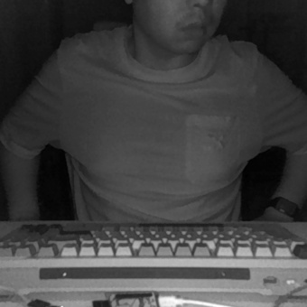
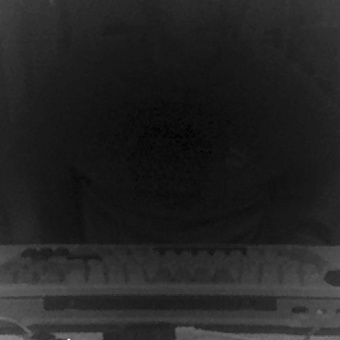

# 06 — 打开 Windows Hello 红外(IR)相机

> 本文记录 2026-09-13 在 HP 笔记本（`VID_04CA:PID_7086`）上的实测排查与可行方案。
> 结论：**IR 相机可以打开**，但它走的是 Media Foundation + 设备符号链接，
> 和 RGB 相机（OpenCV/DirectShow）完全是两条路。

## 1. 问题：IR 相机在哪儿都"看不见"

设备的 PnP 表里明明有它：

```
Status OK   HP Wide Vision FHD Camera   USB\VID_04CA&PID_7086&MI_00\9&24B3143E&0&0000
Status OK   HP IR Camera                USB\VID_04CA&PID_7086&MI_02\9&24B3143E&0&0002
```

但用任何常规手段去枚举摄像头，它都不出现：

| 枚举方式 | 结果 |
|---|---|
| `cv2.VideoCapture(i, CAP_DSHOW)` 扫 0..7 | 只有 2 台（FHD + Nikon 虚拟相机），**没有 IR** |
| `duvc_ctl.list_cameras()` | 同上，2 台 |
| `cv2.VideoCapture(i, CAP_MSMF)` | 全部打不开（这套 OpenCV 构建 `hasBackend(MSMF) == False`）|
| `MFEnumDeviceSources(VIDCAP)` | **count = 1**，只有 FHD |

### 为什么会被"藏起来"

查注册表 `HKLM\SYSTEM\CurrentControlSet\Control\DeviceClasses`，
MI_02 这个接口注册了这些类别：

| 类别 GUID | 名称 | 含义 |
|---|---|---|
| `{e5323777-f976-4f5b-9b55-b94699c46e44}` | KSCATEGORY_VIDEO_CAMERA | 普通相机 |
| `{24e552d7-6523-47f7-a647-d3465bf1f5ca}` | **KSCATEGORY_SENSOR_CAMERA** | Windows Hello 专用类别 |
| `{65e8773d-8f56-11d0-a3b9-00a0c9223196}` | KSCATEGORY_CAPTURE | DirectShow 采集 |

再用 Windows 自己的 WinRT 枚举器对比（`Windows.Devices.Enumeration`）：

```
MediaDevice.GetVideoCaptureSelector()  →  count = 1     ← 只有 FHD，IR 被过滤
  selector 内容里带着条件:
  ... AND (System.Devices.WinPhone8CameraFlags:=[] OR ...:<4096)

裸查 VIDEO_CAMERA 接口类别        →  count = 2     ← FHD + HP IR Camera 都在
裸查 SENSOR_CAMERA 接口类别       →  count = 1     ← MI_02
```

**结论**：IR 相机不是没有接口，而是被 Hello 的隐私策略
（摄像机选择器里的 `WinPhone8CameraFlags` 条件）从"普通摄像头"枚举里过滤掉了。
设备接口本身是真实可用的 —— 拿到符号链接就能直接用。

## 2. 可用的符号链接（本机实测）

`\\?\USB#VID_04CA&PID_7086&MI_02#9&24B3143E&0&0002#{<类别 GUID>}\GLOBAL`

三个类别都能打开，等价：

```
#{24e552d7-6523-47f7-a647-d3465bf1f5ca}\GLOBAL    ← SENSOR_CAMERA（推荐）
#{e5323777-f976-4f5b-9b55-b94699c46e44}\GLOBAL    ← VIDEO_CAMERA
#{65e8773d-8f56-11d0-a3b9-00a0c9223196}\GLOBAL    ← KSCATEGORY_CAPTURE
```

> ⚠️ 结尾的 `\GLOBAL` 不能省。少了它 `MFCreateDeviceSource` 返回 `0x80070002`
> （ERROR_FILE_NOT_FOUND），很容易误判成"设备不存在"。

类别 GUID 由 PnP 实例 ID 推导即可，不必去读注册表：

```python
def link_for(instance_id, category_guid):
    return "\\\\?\\" + instance_id.replace("\\", "#") + "#" + category_guid + "\\GLOBAL"
```

`camera_core.device_links()` 就是这么做的（并用注册表核对接口是否真的存在）。

## 3. 打开它：Media Foundation

```python
from camera_ir import IrCamera

with IrCamera() as ir:                 # 自动找 IR 相机、自动挑亮帧
    print(ir.info())
    ir.snapshot("ir.jpg")              # 默认做对比度拉伸，人眼才看得清
    lit, dark, delta = ir.read_pair()  # 补光灯亮/灭两帧（活体检测原料）
```

底层三步（`camera_ir.py` 用 ctypes 直接调 COM，无第三方依赖）：

1. `MFCreateAttributes` + `SetGUID(SOURCE_TYPE=VIDCAP)` + `SetString(SYMBOLIC_LINK, <链接>)`
2. `MFCreateDeviceSource` → `MFCreateSourceReaderFromMediaSource`
3. `GetNativeMediaType(0,0)` → `SetCurrentMediaType` → 循环 `ReadSample`

关键的 COM vtable 槽位（ctypes 手写时最容易搞错的地方）：

| 接口 | 槽位 | 方法 |
|---|---|---|
| IMFAttributes | 8 / 10 / 11 / 12 / 24 / 25 | GetUINT64 / GetGUID / GetStringLength / GetString / **SetGUID** / SetString |
| IMFActivate | 33 | ActivateObject |
| IMFSourceReader | 5 / 7 / 9 | GetNativeMediaType / SetCurrentMediaType / ReadSample |
| IMFSample | 41 | ConvertToContiguousBuffer |
| IMFMediaBuffer | 3 / 4 | Lock / Unlock |

> `GetGUID` / `GetUINT64` 属于 **IMFAttributes**，媒体类型对象继承它 ——
> 要对 `mt` 调用，**不能**对 `IMFSourceReader`（它的 8/10 号槽是
> SetCurrentPosition / Flush，调错直接 access violation）。

## 4. 实测参数

| 项目 | 实测值 |
|---|---|
| 原生媒体类型 | **YUY2 340×340（唯一一种）** |
| 帧率 | **约 31 fps**，帧间隔 32 ms |
| 曝光 | 相机自管，开流后 1~2 秒自动爬坡（首帧 mean≈5 → 稳定后 80~120） |
| `IAMCameraControl` | **不支持**（`GetServiceForStream` 返回 `E_NOINTERFACE`），无法手动锁曝光 |
| 与 RGB 的关系 | 同一 USB 复合设备：`MI_00` = RGB，`MI_02` = IR |

### 补光灯交替帧（重要特性）

逐帧连续采样会发现亮度在**两个值之间严格交替**：

```
frame 0  mean= 81.11   ← IR 补光灯点亮
frame 1  mean= 38.02   ← 补光灯熄灭，只有环境红外
frame 2  mean= 79.57
frame 3  mean= 37.92
...
```

对比两帧图像可以看得很清楚：

| 补光灯点亮 | 补光灯熄灭 |
|---|---|
|  |  |

补光灯点亮那帧能看清人脸和键盘；熄灭那帧只剩环境红外。

这正是 **Windows Hello 做活体检测的原理** —— 比较"打光 / 不打光"两帧：
真实皮肤会强烈反射 IR 光（两帧差异大），照片或屏幕不会（差异小）。

`camera_ir.py` 因此提供：

* `read(prefer="bright")` —— 默认行为，自动连读两帧挑亮的那张（代价：有效帧率减半）
* `read_pair()` —— 直接给出 `(亮帧, 灭帧, 亮度差)`，可作为自写活体判据的输入

## 5. 踩过的坑（都是血泪，别再踩）

| 现象 | 根因 | 解法 |
|---|---|---|
| 读十来个帧后 `ReadSample` **永久阻塞** | 每帧的 `IMFSample` / `IMFMediaBuffer` 没 `Release`，缓冲区是**池化**的，耗尽就再也拿不到 | 每帧结束把 buffer 和 sample 都 Release |
| 程序跑完不退出，卡在收尾 | `MFShutdown()` 会等未释放的 COM 对象 | 先 Release 全部对象，再 `MFShutdown()` |
| 上一次进程被强杀后，再打开就报 `0xC00D3704`（MF_E_HW_MFT_FAILED_START_STREAMING） | IR 相机被留在"占用 / 启动失败"态 | 结束残留进程；仍不行就重新插拔设备（重启也行） |
| `MFCreateDeviceSource` 返回 `0x80070002` | 符号链接少了结尾的 `\GLOBAL` | 补上 `\GLOBAL` |
| `GetGUID` 调用就崩（access violation） | 把 `IMFAttributes` 的槽位用在了 `IMFSourceReader` 上 | 见上面的 vtable 表 |
| 采样亮度一半 80 一半 38，以为采集有问题 | 是补光灯交替帧，不是 bug | `prefer="bright"` 或 `read_pair()` |

## 6. 局限与后续可做的事

* **不能手动锁曝光**：IR 相机不暴露 `IAMCameraControl`。想要稳定亮度只能靠
  丢弃前若干帧等自动曝光收敛（`warmup`）。
* **不能主动点灯**：补光灯由相机固件按帧交替驱动。UVC 的 XU（扩展单元）
  里可能有独立的补光灯控制，但 `duvc-ctl` 不暴露 XU，需要自己写 KSPropertySet
  调用（`archive/probes/uvc_probe*.py` 里有早期尝试）。
* **活体检测没做成产品**：`read_pair()` 只提供"原料"（亮帧/灭帧/亮度差），
  真要做判断还需要人脸对齐 + 阈值标定。
* 换机型时符号链接会变，但 `camera_core` 是**按 PnP 实例 ID 推导**的，
  理论上即插即用；非 HP 机型（`MI_02` 不一定是 IR）需要看 `classify()` 的分类结果。
