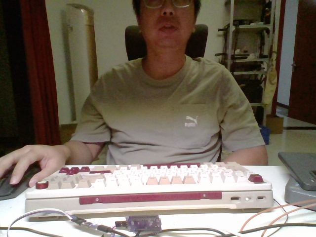
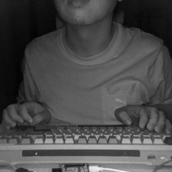
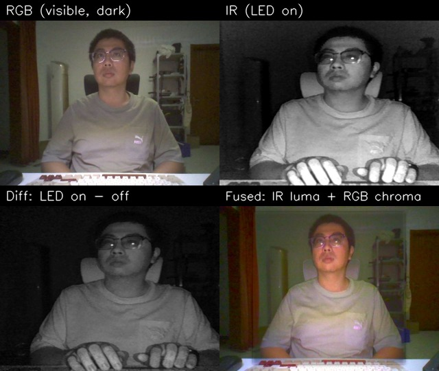

# 07 — IR 波段、可见光融合、以及补光灯到底可不可控

> 2026-09-13 实测（HP 笔记本 `VID_04CA:PID_7086`，RGB=MI_00 / IR=MI_02）。
> 本文回答四个问题：**波段是多少？能不能融合？有哪些应用？补光可控吗？**

---

## 一、IR 波段：软件查不到，只能实测判别

### 1.1 我把能查的地方都查了 —— 都没有

| 查询途径 | 结果 |
|---|---|
| PnP 设备属性（`Get-PnpDeviceProperty` 全量） | 只有 `HP IR Camera` / `USB 视频设备` / `Microsoft`，**无波段字段** |
| 驱动 INF | 用的是**微软通用驱动** `usbvideo.inf`（10.0.19041.6033），里面没有 850/940/wavelength 之类 |
| USB 描述符友好名 | `HP IR Camera`（就是设备管理器里显示的那个字符串），无技术参数 |
| `MFEnumDeviceSources` 的属性 | 只有 friendly name / symbolic link / category，无波段 |
| `IKsControl` 读内核流属性 | `0x80070492` ERROR_SET_NOT_FOUND（见第四节），**取不到 UVC 扩展单元** |
| `IAMCameraControl` | 接口在，但每个调用都 `0x80070490` ERROR_NOT_FOUND |

**结论：波段不是软件可查询的元数据。** 它写在摄像头模组的规格书里，固件不会通过
UVC/MF/KS 报出来（UVC 标准本身也没有"波长"这个字段）。

### 1.2 为什么大概率是 850nm 或 940nm

Windows Hello 认证对 IR 照明的要求就落在这两个波长：

| | 850nm | 940nm |
|---|---|---|
| 人眼可见性 | 暗环境下能看到**微弱暗红光点** | **完全不可见** |
| 太阳光干扰 | 大气/阳光里有大量 850nm，室外差 | 太阳光谱在 940nm 有明显水汽吸收谷，室外更抗干扰 |
| 硅传感器响应 | 高（QE 较大） | 低一些（约 850nm 的 1/2~1/3） |
| 水吸收 | 弱（穿透数 10cm 级） | **强**（穿透 数 cm 级） |
| 成本/年代 | 便宜、老设计常用 | 略贵、2020 年后的新机型更常见 |
| 功率需求 | 低 | 高（因为 QE 低，要更亮的 LED） |

### 1.3 三个能自己做的判别实验（从快到准）

**① 肉眼法（10 秒，最直接）**
关灯，眼睛适应 30 秒，正对笔记本摄像头模组看 IR 窗口。
- 看到**微弱暗红光点** → 850nm
- **什么都看不到** → 940nm

> 注意：不要长时间直视，虽然 IR 不可见但依然有能量。

**② 手机法（10 秒）**
用手机前置摄像头对着笔记本 IR 窗口拍（大多数手机传感器的 IR-cut 挡不干净）：
- 画面里有明显亮点 → 850nm 可能性大
- 几乎没有 → 940nm

**③ 水吸收法（定量，需要半分钟）**
940nm 在水里的吸收比 850nm 强一个量级左右。做法：
1. 拿一个装满水的透明瓶子，后面贴白纸
2. 用本工具的"补光差分"模式看它（这个模式会抵消环境红外，只留补光灯的贡献）
3. 对比"隔着水"和"不隔水"的亮度比：
   - 比值 **> 0.4** → 偏向 850nm
   - 比值 **< 0.15** → 偏向 940nm

**④ 已知光源对照法**
拿一个电视/空调遥控器（绝大多数是 940nm），对着 IR 相机按：
如果 LED 在画面里**非常亮**，说明传感器的响应能覆盖 940nm —— 但这只说明**传感器**，
不能证明**补光灯**是 940nm（传感器普遍能到 940）。

> 想 100% 确定只有一条路：查这个模组的规格书 / HP 维修手册 / iFixit 拆解，
> 或者用光谱仪/带刻度的高通滤光片实测。软件层面到此为止。

---

## 二、可见光 + 红外融合：可以，而且效果不错

### 2.1 为什么能融合

两路相机**在同一个模组上、看同一个场景**，只是成像机理不同：

* **RGB**：有颜色、分辨率高，但暗光下信噪比崩塌（噪声大、曝光拉长导致糊）
* **IR**：自带补光，暗光下信噪比好、纹理清晰，但**没有颜色**、分辨率低（340×340）

融合的经典做法：**亮度取 IR、色度取 RGB**。暗光下 RGB 的色度虽然也暗，
但"颜色对不对"和"亮不亮"是两件事 —— 色度信号即使很弱也仍然指向正确的颜色方向，
放大 + 降噪后就能恢复出可看的彩色。

### 2.2 本机实测的配准参数

IR 是 340×340 的**窄视场**，RGB 是 640×480 的宽视场，两者差一个缩放加平移：

```
x_rgb = 1.300 * x_ir + 98
y_rgb = 1.300 * y_ir + 18
```

（IR 340×340 放大 1.3 倍后是 442×442，落在 640×480 的中央 —— 物理上合理：
两个传感器同轴心，IR 视场更窄。旋转实测 ≈ -0.3°，可忽略。）

标定方法用的是 **梯度图 + 多尺度模板匹配**：把两图都转成梯度幅值图，
对每个缩放候选做 `cv2.matchTemplate(TM_CCOEFF_NORMED)` 找最佳平移。
实测相关度峰值 0.577，落在 scale=1.300 / (98,18)，且**目视边缘完全重合**。

> ⚠️ 别用 ORB/SIFT 自动匹配：跨模态（灰度 vs 彩色、不同响应曲线）下特征点会被
> 背景纹理骗走 —— 我实测 ORB 给出的解是错的（偏到左上，边缘对不上）。

### 2.3 实测效果

| RGB（暗，mean 87） | IR（补光灯亮，mean 79） |
|---|---|
|  |  |

四联对比（RGB / IR / 补光差分 / 融合）：



融合后的特点：人脸被 IR 补光提亮、眼镜反光清晰、**肤色和衣服/木地板颜色仍在**，
背景因为 IR 只覆盖中央区域而回落到 RGB（所以边缘会暗一圈，已用羽化掩码平滑过渡）。

### 2.4 工程上的三个坑（都已在代码里处理）

1. **USB 带宽会打架** —— 两路同时开流时，RGB 如果用未压缩 YUY2 会从 30fps
   崩到 **1.3fps**（几乎读不到帧、拿到黑帧）。换成 **MJPG** 后：
   **RGB 15fps + IR 31fps** 并发稳定。注意 OpenCV 里设 FOURCC 的顺序 ——
   改分辨率会把 FOURCC 复位，必须 `先设 MJPG → 设分辨率 → 再设一次 MJPG`。
2. **暗光下色度是噪声** —— 直接把色度放大 N 倍会得到一屏彩噪。
   必须**先按增益比例模糊降噪再放大**，颜色才自然。
3. **IR 相机是独占的** —— 同一时刻只能有一个进程打开它，第二个会报
   `0xC00D3704`。App 和命令行脚本不能同时跑。

---

## 三、IR + 可见光融合的典型应用

| 领域 | 应用 | 用到 IR 的什么特性 |
|---|---|---|
| **安防监控** | 日夜两用相机、夜间彩色化 | IR 补光在无光环境仍成像；融合保住颜色便于人眼/算法理解 |
| **身份认证** | 人脸识别活体检测（防照片/屏幕/面具攻击） | 皮肤对 IR 的反射特性 + 补光灯亮灭差分 |
| **驾驶员监控 DMS** | 疲劳/分心检测 | 近红外补光**不刺眼**，夜间也能拍到眼睛/瞳孔 |
| **生物医学** | 静脉成像、皮肤分析、眼动追踪 | 血液在 850nm 附近有特征吸收；IR 不看肤色差异 |
| **工业检测** | 缺陷检测、材料分选、太阳能电池片检测 | 不同材料在 NIR 反射率差异，能看出可见光下同色的东西 |
| **农业遥感** | NDVI 植被指数、作物长势 | 健康植被在 NIR 强反射 |
| **图像增强** | 去雾、去烟、暗光细节增强 | NIR 散射比可见光弱（雾霾颗粒小） |
| **目标识别** | 伪装识别、反光标识/回归反射材料检测 | 迷彩与植被在 NIR 下的差异；反光标在 IR 下极亮 |
| **消费电子** | 结构光/ToF 深度、Face ID、眼球追踪 | 940nm 不可见、不干扰用户 |

**本机能直接玩到的**：暗光彩色化、活体检测原料、补光差分成像（见下）。

---

## 四、补光灯：**固件自动频闪，软件不可控**

### 4.1 证据链

我把所有能到达的软件层都试了一遍：

| 途径 | 结果 | 含义 |
|---|---|---|
| `duvc-ctl`（DirectShow） | `open_camera(link)` → `is_ok() = False`；`find_device_by_path` → 找不到设备 | IR 不在 DShow 枚举里，绑不上 |
| `IAMCameraControl`（MF 服务） | 接口**拿到了**（S_OK），但 `GetRange`/`Get`/`Set` 全部 `0x80070490` ERROR_NOT_FOUND | 驱动不实现任何相机控制（曝光/增益/焦点都锁不了）|
| `IKsControl`（MF 服务） | 接口拿到了，但 `KSPROPSETID_Topology` 三个属性全 `0x80070492` ERROR_SET_NOT_FOUND | 到不了 UVC 扩展单元（XU），所以**补光灯、XU 私有控制都够不着** |
| `IAMVideoProcAmp` / `IKsPropertySet` / `IKsTopologyInfo` | 都是 `E_NOINTERFACE` | 同路 |

**结论：在这台机器上，补光灯由相机固件按帧自动驱动，软件层面不可控。**
实测节律是**严格的 2 帧一循环**：亮帧 mean≈80、灭帧 mean≈38，各 15Hz。

> 想真控它，得走 USB 层面的 UVC 扩展单元（XU）请求 —— 需要先拿到 XU 的
> 128 位 GUID（只在 USB 视频控制接口描述符里，Windows 不给），再绕过驱动直接发
> `SET_CUR`。属于逆向工程量级，收益不确定（很多 Hello 模组的补光灯根本不暴露 XU）。

### 4.2 但"自动频闪"本身就是个礼物 —— 差分就是强化

既然它一定亮/灭交替，那**取相邻两帧相减**就得到一个非常干净的量：

```
补光分量 = | 亮帧 − 灭帧 |      ← 环境红外（阳光、灯、暖器）被完全抵消
```

剩下的**只有被 IR 补光灯照亮的那些东西**。这就是最直接的"强化对象"手段：

| 差分能做什么 | 为什么 |
|---|---|
| **对象强化 / 剔除环境光** | 背景红外干扰全部消失，只留下补光照明区域内的物体（见对比图左下角）|
| **活体检测** | 真皮肤强烈反射 IR（两帧差异大），照片/屏幕差异小 —— Hello 的原始原理 |
| **材质/颜色不可见的差异** | 某些黑色染料、塑料在 NIR 下反射率差别很大 |
| **反光标识检测** | 回归反射材料（安全背心、路标、猫眼）在 IR 下极亮 |
| **运动检测** | 两帧间隔 32ms，差分天然带运动信息，比 RGB 帧差更抗光照变化 |
| **降噪** | 亮/灭两帧平均可以降随机噪声 |

代码里现成可用的接口：

```python
from camera_ir import IrCamera
with IrCamera() as ir:
    lit, dark, delta = ir.read_pair()        # 活体检测原料
    import cv2
    diff = cv2.absdiff(lit, dark)            # 纯补光照明分量
```

App 里的 **"补光差分"** 模式就是这个，实时显示。

---

## 五、融合演示台 App 怎么用

```bash
python ir_fusion_app.py                        # 默认：融合模式 + 本机标定好的对齐
python ir_fusion_app.py --auto-align --weight 0.65 --chroma 2.0
python ir_fusion_app.py --no-ir                # 只看 RGB
```

界面：上方是大画面，下面三个缩略图（RGB / IR / 补光差分），再下面是控制条。

| 控件 | 作用 |
|---|---|
| **模式** | 融合 / 细节注入 / RGB / IR / IR 伪彩 / 补光差分 / 并排 |
| **融合权重** | 0=纯 RGB 亮度，1=纯 IR 亮度（0.6 左右最自然）|
| **IR 增益** | IR 太暗时提亮 |
| **彩度** | 暗光下放大 RGB 色度（会先降噪），1.0=原始 |
| **对齐 scale/tx/ty/rot** | 微调配准；**自动标定**按钮用梯度模板匹配重算 |
| **存图 / 暂停** | 存 `captures/` 下的 rgb_*/ir_*/view_*.jpg |

快捷键：`空格` 暂停 · `S` 存图 · `A` 自动标定 · `R` 重置对齐 · `Q/Esc` 退出

状态栏会显示两路实测帧率和 FOURCC —— 如果 RGB 显示成 `YUY2` 且 fps 只有个位数，
说明 MJPG 没设上，两路正在抢带宽。
